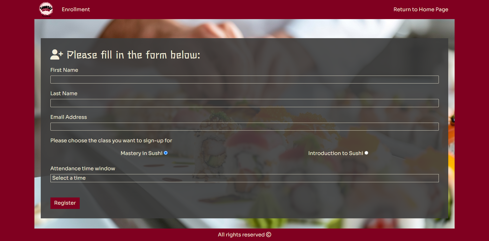
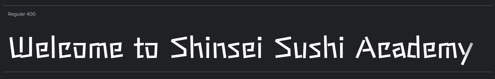
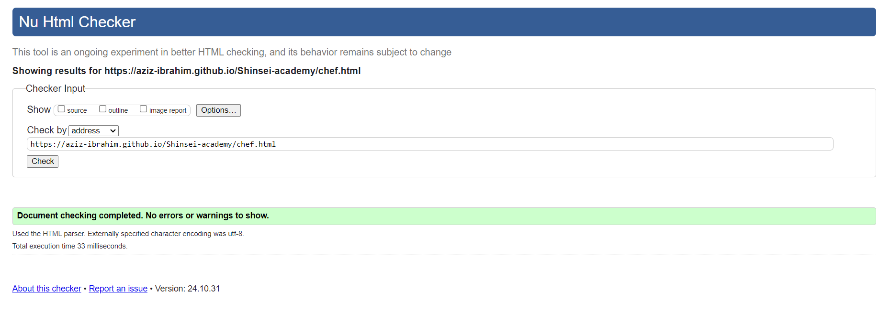

---

# *Shinsie Sushi Academy*

 Shinsie Sushi Academy website allows people to learn about the academy and find information about the different classes the academy provides for chefs from all levels. The visitors of the website could quickly contact the academy about enrolling as well as making a enquiries.

The site can be accessed by this [link](https://aziz-ibrahim.github.io/Shinsei-academy/)

---

## Table of Contents

1. [User Stories](#user-stories)
   - [First Time Visitor Goals](#first-time-visitor-goals)
   - [Returning Visitor Goals](#returning-visitor-goals)
   - [Frequent Visitor Goals](#frequent-visitor-goals)

2. [Features](#features)
   - [Navbar](#navbar)
   - [Home Page](#home-page)
   - [Hero Section](#hero-section)
   - [Our Philosophy Section](#our-philosophy-section)
   - [Our Vision Section](#our-vision-section)
   - [Our Classes Section](#our-classes-section)
   - [Contact Us Section](#contact-us-section)
   - [Footer](#footer)
   - [Chef Page](#chef-page)
   - [Enroll Page](#enroll-page)
   - [Confirm Page](#confirm-page)
   - [Download Page](#download-page)

3. [Technologies Used](#technologies-used)

4. [Design](#design)
   - [Color Scheme](#color-scheme)
   - [Typography](#typography)
   - [Wireframe](#wireframe)

5. [Testing](#testing)
   - [Cross-Browser Compatibility](#cross-browser-compatibility)
   - [Responsive Design Testing](#responsive-design-testing)
   - [Accessibility Testing](#accessibility-testing)
   - [DevTools Testing](#devtools-testing)
   - [Manual Testing](#manual-testing)

6. [Deployment](#deployment)
   - [Deployment to GitHub Pages](#deployment-to-github-pages)
   - [Local Deployment](#local-deployment)

7. [Future Improvements](#future-improvements)

8. [Credits](#credits)
   - [Content](#content)
   - [Media](#media)
   - [Tools](#tools)

9. [Acknowledgements](#acknowledgements)

---
## User Stories

- User stories planning board can be found in [this link](https://github.com/users/Aziz-Ibrahim/projects/6)

### First Time Visitor Goals:

* As a First Time Visitor, I want to easily understand the main purpose of the site, so I can learn more about the academy.
* As a First Time Visitor, I want to be able to easily navigate through the website, so I can find the content.

### Returning VisitorGoals:

* As a Returning Visitor, I want to see various classes, so that I can choose which suites me best.
* As a Returning Visitor, I want to see information about master chef Tsumori Hayenami.
* As a Returning Visitor, I want to find a way to get in contact with the academy, so that I can ask additional questions or send a request about a particular class.
* As a Returning Visitor, I want to find out more about the academy's vision and heritage.

### Frequent Visitor Goals:
* As a Frequent User, I want to check whether there are any changes with available classes, and attendance times.
* As a Frequent User, I want to have options for the reason to contact the academy, so I can get an explicit answer to my email. 

## Features

+ ### Navbar

+ ##### Navigation
    - Positioned at the top of the page.
    - Contains logo of the academy on the left side.
    - Contains navigation links on the right side:
        * HOME - leads to the home page where users can learn about the adademy's core values.
        * OUR PHILOSOPHY - leads to a section where users can learn more about the academy's philosophy and culinary teaching methods.
        * OUR VISION - leads to a section where users can find more about the academy's vision.
        * CONTACT US - leads to section where users can fill out the form in order to get in touch with the academy, as well as find the telephone number and address.
        * MASTER CHEF - leads to a page dedicated master chef Tsumori Hayenami where users can learn more about him and his heritage.
    - The links have animated hover effect.
    - The navigation is clear and easy to understand for the user.
    
    * I intentially separated the page title from the logo as the page title changes in different pages, I kept the <a> link containing only the logo to go back to home page on click!

    - The navigation bar is responsive:
        * On tablets: 
           - navigation bar filled with the logo in the left hand side, the academy's name in the center, and a hamburger menu implemented on the right hand side of the navigation bar.
        
           - When the hamburger menu is clicked, there is dropdown menu with the links in the same order.
        

        * On mobile phones: 
           - navigation bar filled with the logo in the left hand side, the academy's name in the center, and a hamburger menu implemented on the right hand side of the navigation bar.
        
           - When the hamburger menu is clicked, there is dropdown menu with the links in the same order.
        

---

+ ### Home Page

    - Represent: 

        * the core values of the academy.
        * showcase the philosophy on which the academy was built.
        * promote the academy's vision.
        * makes it easy to contact the acadmy by filling out the contact form.

    

---

+ #### Hero Section

    - Hero section have a fixed background image.

    - Hero section have the block section below the image that consist:

        * A welcome message.
        * Short description of the academy's core values.
        

    
    

--- 

+ #### Our Philosophy Section

    - Section showcases the academy's philosophy.
    - Section houses an image of one of the academy's fine work.

    
    

    ---
+ #### Our Vision Section

    - Section has two paragraphs that promote the vision of the academy and the reasons why it is operating in London.
    - Section houses two images illustrating some of the academy's fine work.

​
    

---
+ #### Our Classes Section

    - Section contains 2 cards that explain what each class is and who is it designed for.
    - Each card holds the class name, an image related to the class. reasons why this class my suite the user and a button that takes user to the enrollment page.
​
    

---
+ #### Contact Us Section

    - Section has four different parts;
    * An embedded map showing the academy's location.
    * Contact details such as phone number, email address, postal address.
    * Cntact form for direct messaging.
    * Links to social media platforms.
​
    

---
+ #### Footer
     - Footer has a short message about the copyrights.
​
---
+ ### Chef Page

    - Chef page has a hero image of master chef Tsumori Hayenami and an introduction message for the visitors that contains a short insight about his early begining and upbringing.

    - It has a button right after the introduction message that leads to downloading his recipe book in PDF format.

    - It has two more section that give more information about Tsumori's experience and heritage .

        - The page is responsive: the size and layout of all sections depend on the user's screen.

    - it has a header that houses the logo of the academy and a return to home page link.
    
    - It has a return to home page button.

    - It has a footer identical to the home page's footer.
    
​
    

---
+ ### Enroll page

    - Enroll page has a contact form:

        - Form is set on a background that illustrates sushi being prepared by the hands of master chef Tsumori.
        - All text input fields are customized.
        - All inputs are set to be required to fill out.
        - It has to radiobuttons for the visitors to choose which class they want to apply for:
            - The 1st is - Mastery in Sushi.
            - The 2nd is - Introduction to Sushi Cheffing. 

        - The submit button is animated on hover.

    - The page is responsive on all common screen sizes.
    
    - it has a header that houses the logo of the academy and a return to home page link.

    - The submit button leads to the confirm page.

    - It has a footer identical to the home page's footer.
​
    

---
+ ### Confirm page

    - Confirm page appears after submitting the contact form and the enroll form
    
    - It contains the thank you message and the promise to get in touch with the applicant, advises user to check junk/spam mail to find response. It also gives user an alternative to get a faster response incase they didn't recieve one.
   
    - It has a return to home page button.
    
    - it has a header that houses the logo of the academy and a return to home page link.

    - It has a footer identical to the home page's footer.

    

---
+ ### Download page

    - Download page appears after submitting the book request form on Chef's page.
    
    - It contains the thank you message and text indicating that the download is ready.

    - it has a button that triggers the download of PDF recipe book.
   
    - It has a return to home page button.

    - it has a header that houses the logo of the academy and a return to home page link.

    - It has a footer identical to the home page's footer.

    

---
## Technologies Used

- [HTML](https://code.visualstudio.com/docs/languages/html) was used as the foundation of the site.
- [CSS](https://code.visualstudio.com/docs/languages/css) - was used to add the styles and layout of the site.
- [CSS Flexbox](https://developer.mozilla.org/en-US/docs/Learn/CSS/CSS_layout/Flexbox) - was used to arrange items simmetrically on the pages.
- [Bootstrap](https://getbootstrap.com/docs/5.3/getting-started/introduction/) - was used to make pages responsive.
- [VSCode](https://code.visualstudio.com/) was used as the main tool to write and edit code.
- [Git](https://git-scm.com/) was used for the version control of the website.
- [GitHub](https://github.com/) was used to host the code of the website.
- [GoFullPage Chrome Exyention](https://chromewebstore.google.com/detail/gofullpage-full-page-scre/fdpohaocaechififmbbbbbknoalclacl?hl=en) was used to make and resize images for the README file.

---
## Design

### Color Scheme

- The color scheme for the Shinsei Sushi Academy website has been carefully selected to reflect elements of Japanese culture and create a warm, inviting atmosphere. The primary color, burgundy (#800020), was inspired by the deep red of the Japanese maple leaf and the symbolism of the red circle on the Japanese flag. This rich shade conveys both tradition and sophistication, making it a fitting choice for an educational setting that celebrates Japanese culinary arts and cultural heritage.

- Complementing the burgundy is #f3eed9, a light, neutral tone that adds balance and a sense of calm to the design. This soft background color provides a comfortable contrast, helping the primary elements stand out while creating a spacious, airy feel. The light tone also evokes a sense of openness and simplicity, characteristics often associated with Japanese aesthetics.

- Finally, #d09ea9, a gentle pinkish hue, adds warmth and a welcoming touch to the overall color palette. This color brings an inviting softness to the interface, symbolizing hospitality and harmony, which are central to Japanese culinary philosophy. Together, these colors evoke a sense of tradition, elegance, and warmth, enhancing the user experience and reinforcing the cultural authenticity of the academy's brand.

### Typography

- Sora Google Font was used as the main font of the website in order to increase readability of the content on the pages.

- Stick Google font was used as the headings font in order to complement the Japanese theme of the website.

### Wireframe

---
## Testing

The Shinsei Sushi Academy website was thoroughly tested to ensure consistent performance, visual integrity, and usability across various devices and browsers. The following tests were conducted:

### Cross-Browser Compatibility
The website was tested in multiple browsers, including:

- Google Chrome

- Mozilla Firefox

- Safari (mobile)

- Microsoft Edge

These tests were conducted to verify that the design elements, color scheme, and interactive features are displayed as intended on each platform. Any discrepancies in layout or style were noted and addressed to ensure a uniform user experience.

### Responsive Design Testing
The website was tested on different screen sizes, including desktop, tablet, and mobile devices, to verify responsive behavior. Media queries and flexible layouts were implemented to ensure that content adjusts smoothly across various screen sizes. Testing included portrait and landscape orientations to confirm that all elements retain their usability and visual appeal.
[amIresponsive](https://ui.dev/amiresponsive?url=https://aziz-ibrahim.github.io/Shinsei-academy/)

### Accessibility Testing
Basic accessibility tests were conducted to confirm compliance with accessibility standards, including:

- Verifying semantic HTML and CSS structure.
To ensure that the code for the Shinsei Sushi Academy website adheres to web standards and best practices, HTML, CSS, and JavaScript were validated using the following tools:

* HTML Validation: The HTML code was validated using the [W3C Markup Validation Service](https://validator.w3.org/nu/?doc=https%3A%2F%2Faziz-ibrahim.github.io%2FShinsei-academy%2F). This helped identify and correct any syntax errors, missing tags, and accessibility issues, ensuring that the HTML structure is clean, semantic, and well-formed.

* CSS Validation: The CSS code was validated through the [W3C CSS Validation Service](https://jigsaw.w3.org/css-validator/validator?uri=https%3A%2F%2Faziz-ibrahim.github.io%2FShinsei-academy%2F&profile=css3svg&usermedium=all&warning=1&vextwarning=&lang=en). This process helped catch any syntax errors or deprecated properties, and ensured cross-browser compatibility by following CSS standards.

- Checking color contrast for readability.

- Ensuring that all images and icons have alternative text.

### DevTools Testing
- Google Chrome’s DevTools Lighthouse audit was used to test and optimize the performance, accessibility, SEO, and best practices for the Shinsei Sushi Academy website. Lighthouse provided detailed insights into key areas, including load times, mobile-friendliness, color contrast, and the implementation of modern web practices. Based on the audit’s recommendations, optimizations were made to improve the website’s loading speed, enhance accessibility features, and ensure effective SEO. These adjustments help deliver a seamless, user-friendly experience across devices and contribute to better visibility in search engines.

* Performance score could have been increased by using lower resolution images but I wanted to showcase the highly detailed sushi works!

### Manual Testing

Manual testing was conducted to ensure each feature on the Shinsei Sushi Academy website works as expected across different devices, screen sizes, and browsers. The following outlines the various test cases, expected results, and actual outcomes for each feature.

#### Navbar Testing

| Test Case                               | Steps                                                                                   | Expected Result                                                                                        | Actual Result | Status |
|-----------------------------------------|-----------------------------------------------------------------------------------------|--------------------------------------------------------------------------------------------------------|---------------|--------|
| Navbar links (desktop)                  | Click on each link in the navbar from the homepage and other pages.                      | Each link navigates to the corresponding section or page (e.g., HOME, OUR PHILOSOPHY).                | Pass          | ✅      |
| Navbar logo (desktop)                   | Click on the academy logo in the navbar.                                                | The logo should navigate to the homepage from any page.                                               | Pass          | ✅      |
| Navbar responsiveness (tablet)          | Resize browser window to tablet size and click the hamburger menu.                       | Navbar collapses into a hamburger menu, and links open in a dropdown when clicked.                     | Pass          | ✅      |
| Navbar responsiveness (mobile)          | Resize browser window to mobile size and test the hamburger menu.                        | Navbar collapses into a hamburger menu, and links open in a dropdown when clicked.                     | Pass          | ✅      |

#### Hero Section Testing

| Test Case                               | Steps                                                                                   | Expected Result                                                                                        | Actual Result | Status |
|-----------------------------------------|-----------------------------------------------------------------------------------------|--------------------------------------------------------------------------------------------------------|---------------|--------|
| Hero background image (desktop)         | Load the homepage and observe the hero section.                                         | Background image displays correctly and text overlays appear as intended.                              | Pass          | ✅      |
| Hero background image (mobile)          | Load the homepage on a mobile device and check hero section.                            | Background image adjusts and scales appropriately to the screen size.                                  | Pass          | ✅      |

#### Our Philosophy Section Testing

| Test Case                               | Steps                                                                                   | Expected Result                                                                                        | Actual Result | Status |
|-----------------------------------------|-----------------------------------------------------------------------------------------|--------------------------------------------------------------------------------------------------------|---------------|--------|
| Philosophy text visibility (all devices)| Load the section on desktop, tablet, and mobile.                                        | Text is readable and properly aligned across all devices.                                              | Pass          | ✅      |
| Philosophy image display                | Verify image loads and aligns next to the text (on larger screens).                      | Image loads correctly on all devices and aligns as per screen size (inline or stacked).                | Pass          | ✅      |

#### Contact Us Section Testing

| Test Case                               | Steps                                                                                   | Expected Result                                                                                        | Actual Result | Status |
|-----------------------------------------|-----------------------------------------------------------------------------------------|--------------------------------------------------------------------------------------------------------|---------------|--------|
| Contact form submission                 | Fill out all fields and click "Submit".                                                 | Form submits successfully, and the user is redirected to the confirmation page.                       | Pass          | ✅      |
| Contact form validation                 | Try submitting the form with one or more empty fields.                                  | Error message is displayed, indicating that all fields are required.                                  | Pass          | ✅      |
| Social media links                      | Click on each social media icon link.                                                   | Each icon opens the corresponding social media page in a new tab.                                     | Pass          | ✅      |

#### Chef Page Testing

| Test Case                               | Steps                                                                                   | Expected Result                                                                                        | Actual Result | Status |
|-----------------------------------------|-----------------------------------------------------------------------------------------|--------------------------------------------------------------------------------------------------------|---------------|--------|
| Button to download recipe book          | Click on the "Download Recipe Book" button.                                             | The PDF download starts or a prompt appears to download the file.                                      | Pass          | ✅      |
| Image and content alignment             | Load the page on desktop, tablet, and mobile devices.                                   | Content (image, text) aligns correctly on all devices, scaling appropriately for each screen size.     | Pass          | ✅      |

#### Enroll Page Testing

| Test Case                               | Steps                                                                                   | Expected Result                                                                                        | Actual Result | Status |
|-----------------------------------------|-----------------------------------------------------------------------------------------|--------------------------------------------------------------------------------------------------------|---------------|--------|
| Enrollment form submission              | Select a class and fill out all required fields. Click "Submit".                        | Form submits successfully, and user is redirected to the confirmation page.                           | Pass          | ✅      |
| Enrollment form validation              | Try submitting with missing fields.                                                     | Error message prompts user to complete required fields.                                               | Pass          | ✅      |
| Class selection radio buttons           | Test selection of "Mastery in Sushi" and "Introduction to Sushi Cheffing".              | Only one class can be selected at a time.                                                             | Pass          | ✅      |

#### Confirm Page Testing

| Test Case                               | Steps                                                                                   | Expected Result                                                                                        | Actual Result | Status |
|-----------------------------------------|-----------------------------------------------------------------------------------------|--------------------------------------------------------------------------------------------------------|---------------|--------|
| Confirmation message display            | Submit the contact or enrollment form and view the confirmation page.                   | Thank you message displays, advising user to check for a response.                                    | Pass          | ✅      |
| Return to home button                   | Click "Return to Home" on the confirmation page.                                        | User is redirected to the homepage.                                                                   | Pass          | ✅      |

#### Cross-Browser Testing

The website was tested on the following browsers for compatibility:

| Browser          | Version Tested | Result |
|------------------|----------------|--------|
| Google Chrome    | Latest         | ✅ Pass |
| Mozilla Firefox  | Latest         | ✅ Pass |
| Safari           | Latest         | ✅ Pass |
| Microsoft Edge   | Latest         | ✅ Pass |

#### Responsive Design Testing

The website was tested on multiple screen sizes to ensure responsiveness:

| Device           | Screen Size    | Result       |
|------------------|----------------|--------------|
| Desktop          | > 1024px      | ✅ Pass      |
| Tablet           | 768px - 1024px| ✅ Pass      |
| Mobile           | < 768px       | ✅ Pass      |

#### Summary of Testing

All manual tests were completed successfully. Any minor issues encountered, such as alignment or spacing inconsistencies, were resolved. The site functions smoothly across all tested devices and browsers, providing a consistent and user-friendly experience.

---

## Deployment

### Deployment to GitHub Pages

- The site was deployed to GitHub pages. The steps to deploy are as follows: 
  - In the [GitHub repository](https://github.com/Aziz-Ibrahim/Shinsei-academy), navigate to the Settings tab 
  - From the source section drop-down menu, select the **Main** Branch, then click "Save".
  - The page will be automatically refreshed with a detailed ribbon display to indicate the successful deployment.

The live link can be found [here](https://aziz-ibrahim.github.io/Shinsei-academy/)

### Local Deployment

In order to make a local copy of this project, you can clone it.
In your IDE Terminal, type the following command to clone my repository:

- `git clone https://aziz-ibrahim.github.io/Shinsei-academy.git`

- Alternatively, if you use Gitpod, you can [click here](https://aziz-ibrahim.github.io/Shinsei-academy), which will start the Gitpod workspace for you.

---

## Future improvements
- improve the performance score in home page.
- add custom 404 page.
- improve the quality of the commit messages (I am aware that some of them are very long and not capitalized to comply with the standards and will improve them in the future);
- add fully functional contact form and enroll application form.

---
## Credits

+ #### Content

- The name of the academy was suggested by [chatGPT](https://chatgpt.com/) as well as the name of the master chef.

+ #### Media

    - Most of the images for the website were taken from [StockCake](https://stockcake.com/).
    - Some of the images for the website were taken from [DepositPhotos](https://depositphotos.com/)

+ #### Tools

    - [Image Resizer](https://imageresizer.com/) was used to resize images.
    - [MS Designer](https://designer.microsoft.com/) was used to edit all README.md images.
    - [Color Space](https://mycolor.space/) was used to create the color palette.
    - [Canva Logo Maker](https://www.canva.com/create/logos/) was used to design the academy's logo.

---

## Acknowledgements
- [Ghada Aziz](https://www.linkedin.com/) My wife was a massive support throughout the creation of this project, and helped me choose the colour theme for the website.
- [Iuliia Konovalova](https://github.com/IuliiaKonovalova) My Mentor was a great support and motivation in the creation of this website.
- [Code Institute](https://codeinstitute.net/) tutors and Slack community members for their support and help.
- [Coder Coder](https://www.youtube.com/@TheCoderCoder) for her amazing coding tutorials on her [YouTube channel](https://www.youtube.com/@TheCoderCoder) and [website](https://coder-coder.com/).

---

