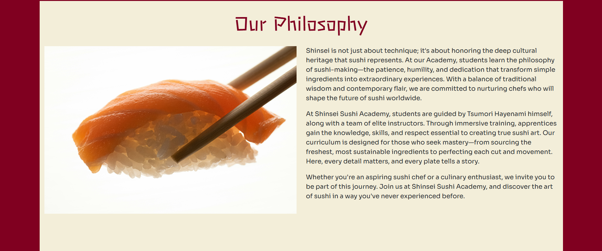
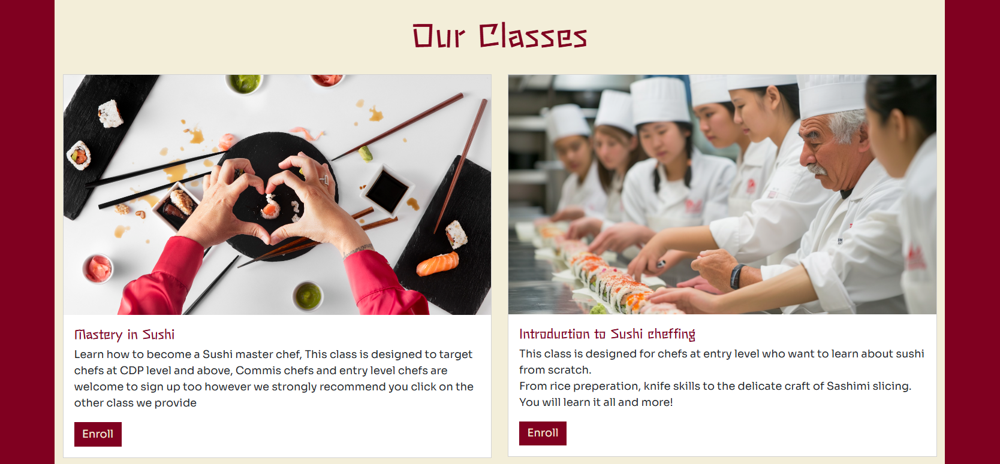
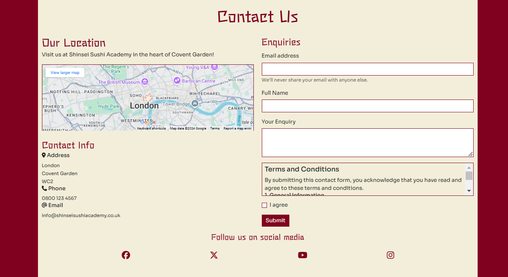
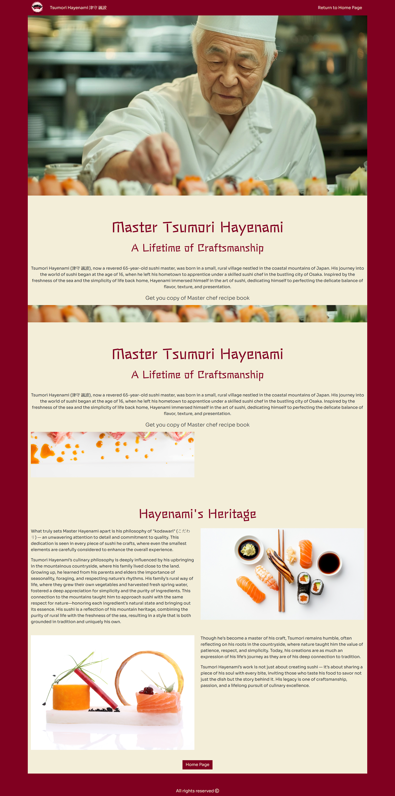

---

# *Shinsie Sushi Academy*

 Shinsie Sushi Academy website allows people to learn about the academy and find information about the different classes the academy provides for chefs from all levels. The visitors of the website could quickly contact the academy about enrolling as well as making a enquiries.

The site can be accessed by this [link](https://aziz-ibrahim.github.io/Shinsei-academy/)

---
## User Stories

### First Time Visitor Goals:

* As a First Time Visitor, I want to easily understand the main purpose of the site, so I can learn more about the academy.
* As a First Time Visitor, I want to be able to easily navigate through the website, so I can find the content.

### Returning VisitorGoals:

* As a Returning Visitor, I want to see various classes, so that I can choose which suites me best.
* As a Returning Visitor, I want to see information about master chef Tsumori Hayenami.
* As a Returning Visitor, I want to find a way to get in contact with the academy, so that I can ask additional questions or send a request about a particular class.
* As a Returning Visitor, I want to find out more about the academy's vision and heritage.

### Frequent Visitor Goals:
* As a Frequent User, I want to check whether there are any changes with available classes, and attendance times.
* As a Frequent User, I want to have options for the reason to contact the academy, so I can get an explicit answer to my email. 

## Features

+ ### Navbar

+ ##### Navigation
    - Positioned at the top of the page.
    - Contains logo of the academy on the left side.
    - Contains navigation links on the right side:
        * HOME - leads to the home page where users can learn about the adademy's core values.
        * OUR PHILOSOPHY - leads to a section where users can learn more about the academy's philosophy and culinary teaching methods.
        * OUR VISION - leads to a section where users can find more about the academy's vision.
        * CONTACT US - leads to section where users can fill out the form in order to get in touch with the academy, as well as find the telephone number and address.
        * MASTER CHEF - leads to a page dedicated master chef Tsumori Hayenami where users can learn more about him and his heritage.
    - The links have animated hover effect.
    - The navigation is clear and easy to understand for the user.
    

    - The navigation bar is responsive:
        * On tablets: 
           - navigation bar filled with the logo in the left hand side, the academy's name in the center, and a hamburger menu implemented on the right hand side of the navigation bar.
        
           - When the hamburger menu is clicked, there is dropdown menu with the links in the same order.
        

        * On mobile phones: 
           - navigation bar filled with the logo in the left hand side, the academy's name in the center, and a hamburger menu implemented on the right hand side of the navigation bar.
        
           - When the hamburger menu is clicked, there is dropdown menu with the links in the same order.
        

---

+ ### Home Page

    - Represent: 

        * the core values of the academy.
        * showcase the philosophy on which the academy was built.
        * promote the academy's vision.
        * makes it easy to contact the acadmy by filling out the contact form.

    

---

+ #### Hero Section

    - Hero section have a fixed background image.

    - Hero section have the block section below the image that consist:

        * A welcome message.
        * Short description of the academy's core values.
        

    
    

--- 

+ #### Our Philosophy Section

    - Section showcases the academy's philosophy.
    - Section houses an image of one of the academy's fine work.

    
    

    ---
+ #### Our Vision Section

    - Section has two paragraphs that promote the vision of the academy and the reasons why it is operating in London.
    - Section houses two images illustrating some of the academy's fine work.

​
    

---
+ #### Our Classes Section

    - Section contains 2 cards that explain what each class is and who is it designed for.
    - Each card holds the class name, an image related to the class. reasons why this class my suite the user and a button that takes user to the enrollment page.
​
    

---
+ #### Contact Us Section

    - Section has four different parts;
    * An embedded map showing the academy's location.
    * Contact details such as phone number, email address, postal address.
    * Cntact form for direct messaging.
    * Links to social media platforms.
​
    

---
+ #### Footer
     - Footer has a short message about the copyrights.
​
---
+ ### Chef Page

    - Chef page has a hero image of master chef Tsumori Hayenami and an introduction message for the visitors that contains a short insight about his early begining and upbringing.

    - It has a button right after the introduction message that leads to downloading his recipe book in PDF format.

    - It has two more section that give more information about Tsumori's experience and heritage .

        - The page is responsive: the size and layout of all sections depend on the user's screen.

    - it has a header that houses the logo of the academy and a return to home page link.
    
    - It has a return to home page button.

    - It has a footer identical to the home page's footer.
    
​
    

---
+ ### Enroll page

    - Enroll page has a contact form:

        - Form is set on a background that illustrates sushi being prepared by the hands of master chef Tsumori.
        - All text input fields are customized.
        - All inputs are set to be required to fill out.
        - It has to radiobuttons for the visitors to choose which class they want to apply for:
            - The 1st is - Mastery in Sushi.
            - The 2nd is - Introduction to Sushi Cheffing. 

        - The submit button is animated on hover.

    - The page is responsive on all common screen sizes.
    
    - it has a header that houses the logo of the academy and a return to home page link.

    - The submit button leads to the confirm page.

    - It has a footer identical to the home page's footer.
​
    

---
+ ### Confirm page

    - Confirm page appears after submitting the contact form and the enroll form
    
    - It contains the thank you message and the promise to get in touch with the applicant, advises user to check junk/spam mail to find response. It also gives user an alternative to get a faster response incase they didn't recieve one.
   
    - It has a return to home page button.
    
    - it has a header that houses the logo of the academy and a return to home page link.

    - It has a footer identical to the home page's footer.

    

---
+ ### Download page

    - Download page appears after submitting the book request form on Chef's page.
    
    - It contains the thank you message and text indicating that the download is ready.

    - it has a button that triggers the download of PDF recipe book.
   
    - It has a return to home page button.

    - it has a header that houses the logo of the academy and a return to home page link.

    - It has a footer identical to the home page's footer.

    

---
## Technologies Used

- [HTML](https://code.visualstudio.com/docs/languages/html) was used as the foundation of the site.
- [CSS](https://code.visualstudio.com/docs/languages/css) - was used to add the styles and layout of the site.
- [CSS Flexbox](https://developer.mozilla.org/en-US/docs/Learn/CSS/CSS_layout/Flexbox) - was used to arrange items simmetrically on the pages.
- [Bootstrap](https://getbootstrap.com/docs/5.3/getting-started/introduction/) - was used to make pages responsive.
- [VSCode](https://code.visualstudio.com/) was used as the main tool to write and edit code.
- [Git](https://git-scm.com/) was used for the version control of the website.
- [GitHub](https://github.com/) was used to host the code of the website.
- [GoFullPage Chrome Exyention](https://chromewebstore.google.com/detail/gofullpage-full-page-scre/fdpohaocaechififmbbbbbknoalclacl?hl=en) was used to make and resize images for the README file.

---
## Design

### Color Scheme

- The color scheme for the Shinsei Sushi Academy website has been carefully selected to reflect elements of Japanese culture and create a warm, inviting atmosphere. The primary color, burgundy (#800020), was inspired by the deep red of the Japanese maple leaf and the symbolism of the red circle on the Japanese flag. This rich shade conveys both tradition and sophistication, making it a fitting choice for an educational setting that celebrates Japanese culinary arts and cultural heritage.

- Complementing the burgundy is #f3eed9, a light, neutral tone that adds balance and a sense of calm to the design. This soft background color provides a comfortable contrast, helping the primary elements stand out while creating a spacious, airy feel. The light tone also evokes a sense of openness and simplicity, characteristics often associated with Japanese aesthetics.

- Finally, #d09ea9, a gentle pinkish hue, adds warmth and a welcoming touch to the overall color palette. This color brings an inviting softness to the interface, symbolizing hospitality and harmony, which are central to Japanese culinary philosophy. Together, these colors evoke a sense of tradition, elegance, and warmth, enhancing the user experience and reinforcing the cultural authenticity of the academy's brand.
